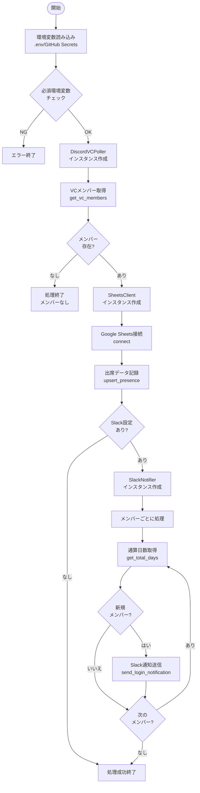
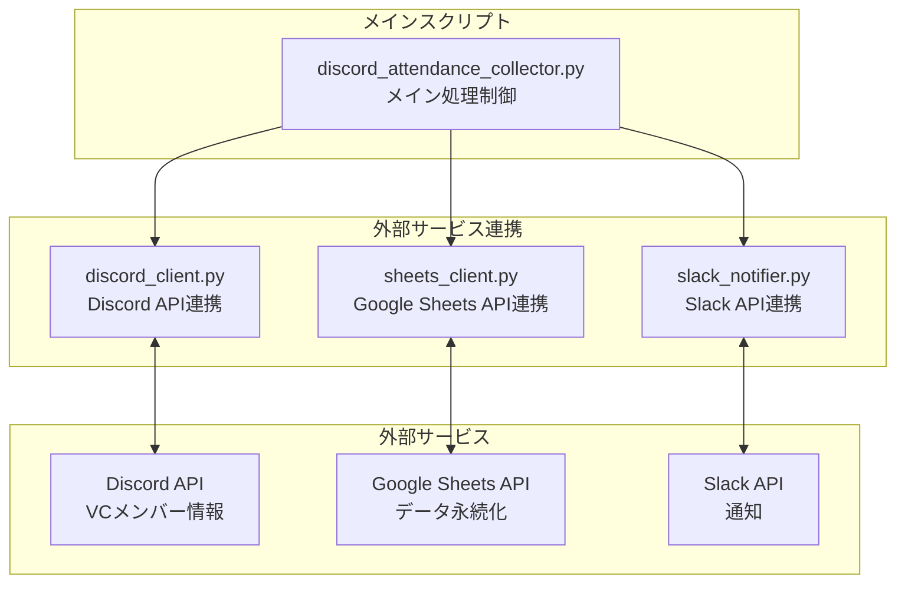
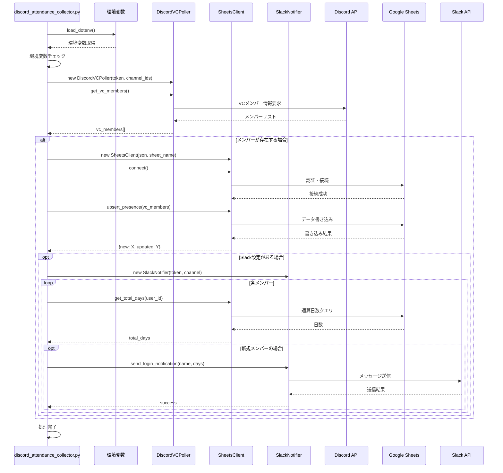
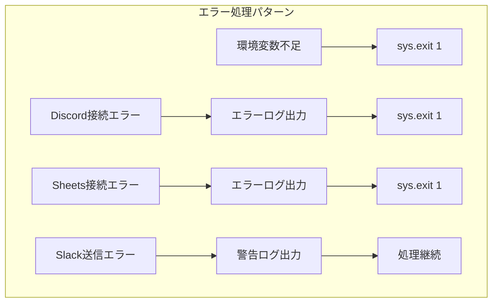

# システムアーキテクチャ

## 📌 概要

Discord VC Trackerシステムの全体的な処理フローと、各モジュール間の連携を説明します。

## 🔄 メイン処理フロー



## 🏗️ モジュール構成



## 📊 データフロー



## 🔄 処理の詳細

### 1. 初期化フェーズ
- **環境変数の読み込み**: `.env`ファイルまたはGitHub Secretsから設定を取得
- **必須パラメータチェック**: 
  - `DISCORD_BOT_TOKEN`
  - `GOOGLE_SHEET_NAME`
  - `ALLOWED_VOICE_CHANNEL_IDS`
  - `service_account.json`の存在確認

### 2. データ取得フェーズ
- **Discord接続**: `DiscordVCPoller`クラスを使用してBotとして接続
- **VCメンバー取得**: 指定されたVCチャンネルIDの現在のメンバーを取得
- **データ形式**:
  ```python
  {
      'guild_id': 'サーバーID',
      'user_id': 'ユーザーID',
      'user_name': 'ユーザー名',
      'timestamp': '取得時刻'
  }
  ```

### 3. データ記録フェーズ
- **Google Sheets接続**: サービスアカウントを使用して認証
- **データ記録**: `upsert_presence()`メソッドで出席データを記録
  - 新規メンバー: 新しい行を追加
  - 既存メンバー: 該当日のデータを更新
- **シート構造**:
  ```
  | date_jst | guild_id | user_id | user_name | present |
  ```

### 4. 通知フェーズ（オプション）
- **条件**: Slack設定が存在し、新規メンバーがいる場合
- **通算日数取得**: 各メンバーの過去の出席日数を集計
- **Slack通知**: フォーマットされたメッセージを送信
  ```
  🎊 XXXさんがVCにログインしました！
  通算: Y日目
  ```

## 🔧 エラーハンドリング



## 📝 ログ出力

各フェーズで以下のログを出力:

1. **開始ログ**: `"Fetching VC members from Discord..."`
2. **メンバー数ログ**: `"Found X members in VCs"`
3. **Sheets接続ログ**: `"Connecting to Google Sheets..."`
4. **記録結果ログ**: `"Recorded: X new, Y updated"`
5. **通知ログ**: `"Notified: Username (Day Z)"`
6. **完了ログ**: `"Poll completed successfully"`

## 🚀 実行方法

### 単体実行
```bash
python discord_attendance_collector.py
```

### GitHub Actions（定期実行）
```yaml
- cron: '*/10 7-12 * * *'  # 日本時間16-21時、10分ごと
```

## 🔍 デバッグ

ログレベルを`DEBUG`に変更することで詳細情報を取得可能:

```python
logging.basicConfig(level=logging.DEBUG)
```

## 📋 依存関係

- **discord.py**: Discord API連携
- **gspread**: Google Sheets API連携
- **google-auth**: Google認証
- **slack-sdk**: Slack API連携
- **python-dotenv**: 環境変数管理
- **pytz**: タイムゾーン処理

## 🎯 設計の特徴

1. **モジュール分離**: 各外部サービスとの連携を独立したクラスで実装
2. **エラーハンドリング**: 各フェーズで適切なエラー処理
3. **ログ出力**: 処理の追跡とデバッグを容易に
4. **環境変数管理**: 設定の外部化によるセキュリティ向上
5. **非同期処理**: Discord APIの非同期特性に対応