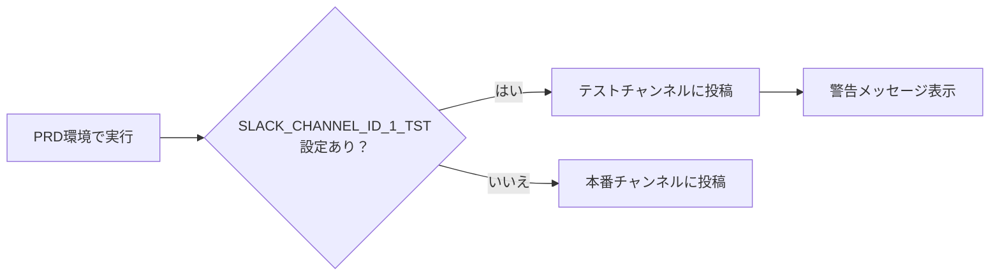

# PRD環境でテスト用Slackチャンネルを使用する方法

## 📌 概要

本番環境（PRD）でSlack通知をテストする際、本番のSlackチャンネルに投稿するのを避けて、テスト用のチャンネルに投稿する機能です。

## 🎯 なぜこの機能が必要？

- **本番チャンネルを汚さない**: テスト中のメッセージが本番チャンネルに流れない
- **安全にテスト**: 本番環境の動作確認を安全に実施できる
- **簡単に切り替え**: 環境変数1つで切り替え可能

## 🚀 設定方法

### ステップ1: GitHub Secretsに設定を追加

1. GitHubリポジトリの「Settings」タブを開く
2. 左メニューから「Secrets and variables」→「Actions」を選択
3. 「New repository secret」をクリック
4. 以下を入力：
   - **Name**: `SLACK_CHANNEL_ID_1_TST`
   - **Secret**: テスト用SlackチャンネルのID（例：`C06XXXXXXXX`）
5. 「Add secret」をクリック

### ステップ2: GitHub Actionsワークフローで環境変数を設定

`.github/workflows/slack_notifier_attendance_0_PRD.yml`に以下を追加：

```yaml
env:
  # ... 既存の環境変数 ...
  SLACK_CHANNEL_ID_1_TST: ${{ secrets.SLACK_CHANNEL_ID_1_TST }}  # テストチャンネル設定
```

## 📊 動作の仕組み



## 💡 使用例

### GitHub Actionsでの設定例

```yaml
name: Slack通知（本番環境）

on:
  schedule:
    - cron: '0 22 * * *'  # 毎日7:00 JST

jobs:
  notify:
    runs-on: ubuntu-latest
    steps:
      - name: Slack通知実行
        env:
          # 本番環境の設定
          GOOGLE_SERVICE_ACCOUNT_JSON_BASE64: ${{ secrets.GOOGLE_SERVICE_ACCOUNT_JSON_BASE64 }}
          DISCORD_BOT_TOKEN: ${{ secrets.DISCORD_BOT_TOKEN }}
          SLACK_TOKEN: ${{ secrets.SLACK_TOKEN }}
          SLACK_CHANNEL_ID: ${{ secrets.SLACK_CHANNEL_ID }}

          # テストチャンネルオーバーライド（これを設定するとテストチャンネルに投稿）
          SLACK_CHANNEL_ID_1_TST: ${{ secrets.SLACK_CHANNEL_ID_1_TST }}
        run: |
          python slack_notifier_attendance.py --env 0  # 0=PRD環境
```

### ローカルでのテスト

```bash
# 環境変数を設定
export SLACK_CHANNEL_ID_1_TST=C06XXXXXXXX  # テストチャンネルID

# PRD環境でテストチャンネルに投稿
python slack_notifier_attendance.py --env 0
```

## 🔍 確認方法

### ログで確認

実行時に以下のようなログが出力されます：

```
⚠️ PRD環境でテストSlackチャンネルを使用: C06XXXXXXXX
⚠️ 注意: PRD環境ですが、テストSlackチャンネルに投稿します
```

### Slackで確認

テスト用チャンネルにメッセージが投稿されているか確認します。

## ⚠️ 注意事項

1. **環境変数名は正確に**: `SLACK_CHANNEL_ID_1_TST`という名前でなければ機能しません
2. **PRD環境でのみ有効**: TST環境やDEV環境では通常通り動作します
3. **警告メッセージに注意**: テストチャンネルを使用時は必ず警告が表示されます

## ❓ FAQ

### Q: テストが終わったら本番チャンネルに戻すには？

**A**: GitHub Secretsから`SLACK_CHANNEL_ID_1_TST`を削除するか、ワークフローファイルから該当行を削除します。

### Q: TST環境でこの設定をしても効果はありますか？

**A**: いいえ、PRD環境（`--env 0`）でのみ有効です。TST環境は元々テスト用なので不要です。

### Q: チャンネルIDはどこで確認できますか？

**A**: Slackでチャンネルを右クリック→「チャンネル詳細を表示」→最下部の「チャンネルID」

## 🔧 トラブルシューティング

### テストチャンネルに投稿されない場合

1. 環境変数名が正しいか確認（`SLACK_CHANNEL_ID_1_TST`）
2. GitHub Secretsに正しく設定されているか確認
3. ワークフローで環境変数が渡されているか確認
4. ログに警告メッセージが出ているか確認

### エラー: `channel_not_found`

- チャンネルIDが正しいか確認
- BotがそのチャンネルにアクセスできるかSlackで確認
- プライベートチャンネルの場合、Botを招待する必要があります

## 📝 関連ドキュメント

- [GitHub Actions初心者ガイド](./GITHUB_ACTIONS_GUIDE.md)
- [GitHub Secrets設定ガイド](./GITHUB_SECRETS_SETUP.md)
- [環境変数ガイド](./ENVIRONMENT_VARIABLES.md)