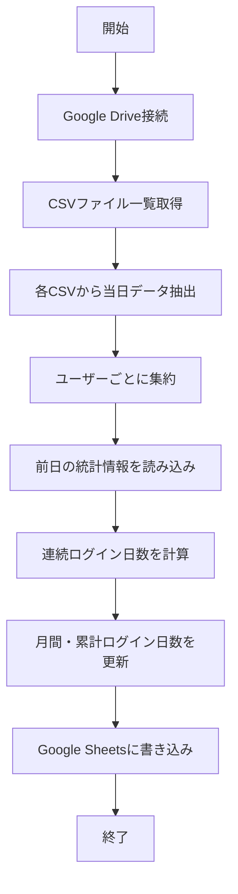

# 日次集計プログラム仕様書

## 📌 このドキュメントについて

1日1回実行される集計プログラムで、Google Drive上のCSVファイルから当日のVCログイン情報を読み取り、
ユーザーごとの統計情報（連続ログイン日数、今月のログイン日数など）を計算してGoogle Sheetsに書き込みます。

## 🎯 プログラムの目的

Discord VCのログイン履歴から以下の情報を集計・可視化します：
- その日にVCにログインしたユーザー一覧
- 各ユーザーの今月のログイン日数
- 各ユーザーの連続ログイン日数
- 各ユーザーの累計ログイン日数

## 📥 Input（入力）

| 項目 | 型 | 説明 | 例 |
|------|-----|------|-----|
| CSV ファイル群 | CSVファイル | Google Drive上の各VCチャンネルのCSVファイル | `general-voice.csv` |
| 集計対象日 | 日付 | 集計する日付（デフォルトは実行日） | `2025-09-15` |
| 環境変数 | 文字列 | Google認証情報とSheets名 | 下記参照 |

### 必要な環境変数

```env
# Google Drive/Sheets認証
GOOGLE_SERVICE_ACCOUNT_JSON=service_account.json

# 集計結果を書き込むGoogle Sheets名
GOOGLE_SHEET_NAME=VC_Tracker_Database

# 対象VCチャンネルIDのリスト（カンマ区切り）
ALLOWED_VOICE_CHANNEL_IDS=123456789,987654321
```

## 📤 Output（出力）

### レポート出力
プログラムは参加者レポートを生成し、以下の形式で出力します：

#### 出力パターン
| パターン | 説明 | 使用例 |
|----------|------|--------|
| `discord` | Discord名で出力（モック/テスト用） | `kawashima#1234 さん　15日目のログインになります。` |
| `slack` | Slackメンションで出力（本番用） | `<@U12345678> さん　15日目のログインになります。` |

※ `--output` オプションで指定可能（デフォルトは `slack`）

### Google Sheetsへの出力

#### 1. daily_summary シート
当日のログインユーザー情報

| 項目 | 型 | 説明 | 例 |
|------|-----|------|-----|
| date | 日付 | 集計日 | `2025/09/15` |
| user_id | 文字列 | Discord ユーザーID | `111111111111111111` |
| user_name | 文字列 | Discord ユーザー名 | `kawashima#1234` |
| vc_channels | 文字列 | ログインしたVCチャンネル名リスト | `general-voice, study-room` |
| login_count | 数値 | その日のログイン回数 | `3` |

#### 2. user_statistics シート
ユーザーごとの統計情報

| 項目 | 型 | 説明 | 例 |
|------|-----|------|-----|
| user_id | 文字列 | Discord ユーザーID | `111111111111111111` |
| user_name | 文字列 | Discord ユーザー名 | `kawashima#1234` |
| last_login_date | 日付 | 最終ログイン日 | `2025/09/15` |
| consecutive_days | 数値 | 連続ログイン日数 | `7` |
| monthly_days | 数値 | 今月のログイン日数 | `12` |
| total_days | 数値 | 累計ログイン日数 | `45` |
| last_updated | 日時 | 最終更新日時 | `2025/09/15 23:00:00` |

## 🔧 処理の流れ



### 詳細な処理ステップ

1. **初期化**
   - Google Drive/Sheets APIクライアント初期化
   - 集計対象日の設定（デフォルト：今日）

2. **データ収集**
   - Google Drive上の`VC_Tracker_Data`フォルダから全CSVファイルを取得
   - 各CSVファイルから集計対象日のレコードを抽出
   - ユーザーIDをキーとして集約

3. **統計計算**
   - 前日までの`user_statistics`シートを読み込み
   - 各ユーザーについて：
     - 連続ログイン日数: 前日ログインしていれば+1、していなければ1にリセット
     - 月間ログイン日数: 同月なら+1、月が変わっていれば1にリセット
     - 累計ログイン日数: 常に+1

4. **データ出力**
   - `daily_summary`シートに当日の集計結果を追記
   - `user_statistics`シートを最新情報で更新

## 💡 使用例

### コマンドライン実行
```bash
# デフォルト（今日のデータを集計、Slackメンションで出力）
python daily_aggregator.py

# 特定日のデータを集計
python daily_aggregator.py --date 2025-09-14

# デバッグモード（詳細ログ出力）
python daily_aggregator.py --debug

# Discord名で出力（モック/テスト用）
python daily_aggregator.py --output discord

# Slackメンションで出力（本番用、デフォルト）
python daily_aggregator.py --output slack

# 環境と出力形式を組み合わせて使用
python daily_aggregator.py --env 0 --output slack  # 本番環境でSlackメンション
python daily_aggregator.py --env 2 --output discord # 開発環境でDiscord名
```

### GitHub Actions（毎日23:00に実行）
```yaml
name: 日次集計処理

on:
  schedule:
    - cron: '0 14 * * *'  # UTC 14:00 = JST 23:00
  workflow_dispatch:  # 手動実行も可能

jobs:
  aggregate:
    runs-on: ubuntu-latest
    steps:
      - uses: actions/checkout@v4
      - uses: actions/setup-python@v5
        with:
          python-version: '3.11'
      - run: pip install -r requirements.txt
      - run: python daily_aggregator.py
        env:
          GOOGLE_SERVICE_ACCOUNT_JSON_BASE64: ${{ secrets.GOOGLE_SERVICE_ACCOUNT_JSON_BASE64 }}
          GOOGLE_SHEET_NAME: ${{ secrets.GOOGLE_SHEET_NAME }}
          ALLOWED_VOICE_CHANNEL_IDS: ${{ secrets.ALLOWED_VOICE_CHANNEL_IDS }}
```

## ⚠️ 注意事項

1. **実行タイミング**
   - 1日1回、その日の終わり（23:00頃）に実行することを推奨
   - 重複実行しても同じ日のデータは上書きされるため安全

2. **タイムゾーン**
   - すべての日時はJST（日本標準時）で処理
   - CSVファイルの日時もJSTで記録されている前提

3. **データ整合性**
   - CSVファイルが更新中の可能性があるため、23:00以降の実行を推奨
   - 前日のデータが存在しない場合は、連続日数を1から開始

4. **パフォーマンス**
   - 大量のユーザーがいる場合、処理に数分かかる可能性がある
   - バッチ処理で効率化を図る

## ❓ FAQ

### Q: 集計を再実行したらどうなりますか？
A: 同じ日のデータは上書きされます。統計情報も再計算されます。

### Q: 過去の日付で集計できますか？
A: はい、`--date`オプションで指定可能です。ただし、連続ログイン日数の計算に影響する可能性があります。

### Q: CSVファイルが見つからない場合は？
A: エラーログを出力して処理を継続します。該当VCチャンネルのデータは0件として扱われます。

### Q: ユーザー名が変更された場合は？
A: ユーザーIDで管理しているため、名前変更は自動的に反映されます。

## 🔗 関連ドキュメント

- [Google Drive CSV Client仕様書](src/drive_csv_client.md)
- [Google Sheets Client仕様書](src/sheets_client.md)
- [ポーリング処理仕様書](discord_attendance_collector.md)