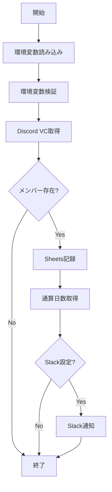

# メイン処理（poll_once.py）仕様書

## 1. 概要

poll_once.pyは、Discord VCの在室状況を取得し、Google Sheetsに記録し、Slackに通知する統合処理を行うメインスクリプトです。

### 1.1 目的
- 各モジュールの統合と制御
- 環境変数の管理
- エラーハンドリングとログ管理
- GitHub Actionsからの定期実行

### 1.2 ファイル構成
```
/
├── poll_once.py        # メイン処理スクリプト
├── .env               # ローカル環境変数（開発用）
└── src/
    ├── discord_client.py
    ├── sheets_client.py
    └── slack_notifier.py
```

## 2. 処理フロー

### 2.1 全体フロー


### 2.2 詳細処理ステップ

#### Step 1: 環境設定
1. `.env`ファイルから環境変数を読み込み（load_dotenv）
2. 必須環境変数の取得
3. 環境変数の検証

#### Step 2: Discord VCメンバー取得
1. DiscordVCPollerインスタンス作成
2. 非同期でVCメンバー情報取得
3. メンバーリストの検証

#### Step 3: Google Sheets記録
1. SheetsClientインスタンス作成
2. Google Sheetsへ接続
3. 出席データのUpsert
4. 処理結果の確認

#### Step 4: Slack通知（オプション）
1. SlackNotifierインスタンス作成
2. 各メンバーの通算日数取得
3. 新規ログインメンバーへの通知送信

## 3. 関数設計

### 3.1 main()関数
```python
async def main()
```

**責務:**
- メイン処理の統合
- エラーハンドリング
- ログ出力

**処理内容:**
1. **環境変数の読み込み**
   ```python
   load_dotenv()
   discord_token = os.getenv('DISCORD_BOT_TOKEN')
   sheet_name = os.getenv('GOOGLE_SHEET_NAME')
   # ... 他の環境変数
   ```

2. **必須環境変数の検証**
   - DISCORD_BOT_TOKEN
   - GOOGLE_SHEET_NAME
   - ALLOWED_VOICE_CHANNEL_IDS
   - サービスアカウントJSONファイルの存在確認

3. **Discord VCメンバー取得**
   ```python
   discord_client = DiscordVCPoller(discord_token, channel_ids)
   vc_members = await discord_client.get_vc_members()
   ```

4. **Google Sheets記録**
   ```python
   sheets_client = SheetsClient(service_account_json, sheet_name)
   sheets_client.connect()
   result = sheets_client.upsert_presence(vc_members)
   ```

5. **Slack通知（条件付き）**
   ```python
   if slack_token and slack_channel:
       slack_client = SlackNotifier(slack_token, slack_channel)
       for member in vc_members:
           total_days = sheets_client.get_total_days(member['user_id'])
           if result['new'] > 0:
               slack_client.send_login_notification(member['user_name'], total_days)
   ```

**エラーハンドリング:**
- try-except で全体をラップ
- エラー時は`sys.exit(1)`で異常終了
- 詳細なエラーログを出力

## 4. 環境変数

### 4.1 必須環境変数
| 変数名 | 説明 | 例 |
|---|---|---|
| DISCORD_BOT_TOKEN | Discord Botトークン | `MTIzNDU2Nzg5...` |
| GOOGLE_SHEET_NAME | スプレッドシート名 | `VC Attendance Log` |
| ALLOWED_VOICE_CHANNEL_IDS | 監視対象VCのID（カンマ区切り） | `123456789,987654321` |

### 4.2 オプション環境変数
| 変数名 | 説明 | デフォルト |
|---|---|---|
| GOOGLE_SERVICE_ACCOUNT_JSON | サービスアカウントJSONパス | `service_account.json` |
| SLACK_BOT_TOKEN | Slack Botトークン | なし |
| SLACK_CHANNEL_ID | Slack通知先チャンネル | なし |

### 4.3 環境変数の検証ロジック
```python
if not discord_token:
    logger.error("DISCORD_BOT_TOKEN is not set")
    sys.exit(1)

if not sheet_name:
    logger.error("GOOGLE_SHEET_NAME is not set")
    sys.exit(1)

if not channel_ids or channel_ids == ['']:
    logger.error("ALLOWED_VOICE_CHANNEL_IDS is not set")
    sys.exit(1)

if not os.path.exists(service_account_json):
    logger.error(f"Service account JSON file not found: {service_account_json}")
    sys.exit(1)
```

## 5. ログ設計

### 5.1 ログ設定
```python
logging.basicConfig(
    level=logging.INFO,
    format='%(asctime)s - %(name)s - %(levelname)s - %(message)s',
    handlers=[logging.StreamHandler()]
)
```

### 5.2 ログレベル
- `INFO`: 正常な処理フロー
- `ERROR`: エラー発生時

### 5.3 ログメッセージ
```
INFO: Fetching VC members from Discord...
INFO: Found 5 members in VCs
INFO: Connecting to Google Sheets...
INFO: Recording presence data...
INFO: Recorded: 3 new, 0 updated
INFO: Sending Slack notifications...
INFO: Notified: user#1234 (Day 10)
INFO: Poll completed successfully
ERROR: DISCORD_BOT_TOKEN is not set
ERROR: Service account JSON file not found: service_account.json
ERROR: Error during polling: [詳細]
```

## 6. エラー処理

### 6.1 エラーの種類と対処

#### 環境変数エラー
- **原因**: 必須環境変数の未設定
- **対処**: エラーログ出力後、`sys.exit(1)`

#### ファイル不在エラー
- **原因**: サービスアカウントJSONファイルが見つからない
- **対処**: エラーログ出力後、`sys.exit(1)`

#### API接続エラー
- **原因**: Discord/Google/Slack APIへの接続失敗
- **対処**: エラーログ出力後、`sys.exit(1)`

#### データ処理エラー
- **原因**: データの変換や処理中のエラー
- **対処**: エラーログ出力後、`sys.exit(1)`

### 6.2 終了コード
- `0`: 正常終了
- `1`: エラーによる異常終了

## 7. 非同期処理

### 7.1 asyncio使用
```python
if __name__ == "__main__":
    asyncio.run(main())
```

### 7.2 非同期処理の範囲
- Discord API通信（必須）
- その他は同期処理

### 7.3 将来の非同期化候補
- Google Sheets API
- Slack API

## 8. モジュール連携

### 8.1 モジュール間のデータフロー
```
DiscordVCPoller
    ↓ [メンバーリスト]
poll_once.py
    ↓ [メンバーリスト]
SheetsClient
    ↓ [処理結果・通算日数]
poll_once.py
    ↓ [メンバー情報・通算日数]
SlackNotifier
```

### 8.2 データ形式
```python
# DiscordVCPoller → poll_once
[
    {
        "guild_id": "123456789",
        "user_id": "111111111",
        "user_name": "user#1234"
    }
]

# SheetsClient → poll_once
{
    "new": 3,
    "updated": 0
}

# poll_once → SlackNotifier
user_name: "user#1234"
total_days: 10
```

## 9. GitHub Actions統合

### 9.1 実行スケジュール
```yaml
schedule:
  - cron: "0,30 19-22 * * *"  # UTC 19-22時（JST 4-7時）の毎時0分と30分
```

### 9.2 環境変数の設定
GitHub Secretsから環境変数を注入:
```yaml
env:
  DISCORD_BOT_TOKEN: ${{ secrets.DISCORD_BOT_TOKEN }}
  GOOGLE_SHEET_NAME: ${{ secrets.GOOGLE_SHEET_NAME }}
  # ... 他の環境変数
```

### 9.3 実行時間
- 想定実行時間: 1-2分
- タイムアウト: 5分（推奨）

## 10. パフォーマンス考慮事項

### 10.1 処理時間の内訳
1. Discord接続・取得: 5-10秒
2. Sheets接続・記録: 2-5秒
3. Slack通知: 1-3秒/メッセージ
4. 合計: 10-30秒（通常時）

### 10.2 最適化ポイント
- Discord: 接続の使い回し（現在は都度接続）
- Sheets: バッチ処理の活用
- Slack: 並行送信の検討

## 11. セキュリティ考慮事項

### 11.1 認証情報の管理
- 環境変数経由でのみ取得
- ログへの出力禁止
- GitHub Secretsで暗号化

### 11.2 エラーメッセージ
- 機密情報を含めない
- スタックトレースの制限

## 12. テスト戦略

### 12.1 単体テスト
- 環境変数の検証ロジック
- エラーハンドリング

### 12.2 統合テスト
- モック環境での全体フロー
- 各モジュールの連携確認

### 12.3 手動テスト
- ローカル環境での実行
- GitHub Actions手動トリガー

## 13. 監視とアラート

### 13.1 監視項目
- 実行成功/失敗
- 処理時間
- エラー発生率

### 13.2 アラート条件
- 3回連続失敗
- 処理時間5分超過
- 特定エラーの頻発

## 14. 今後の拡張可能性

### 14.1 機能拡張
- 複数サーバー対応
- 時間帯別の集計
- 退室時刻の記録
- 滞在時間の計算

### 14.2 アーキテクチャ改善
- イベント駆動型への移行
- WebSocket常時接続
- キューシステムの導入
- マイクロサービス化