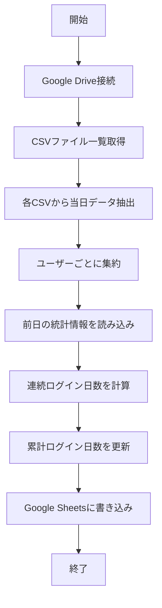

# 日次集計プログラム仕様書

## 📌 このドキュメントについて

1日1回実行される集計プログラムで、Google Drive上のCSVファイルから当日のVCログイン情報を読み取り、
ユーザーごとの統計情報（連続ログイン日数、今月のログイン日数など）を計算してGoogle Sheetsに書き込みます。

## 🎯 プログラムの目的

Discord VCのログイン履歴から以下の情報を集計・可視化します：
- その日にVCにログインしたユーザー一覧
- 各ユーザーの連続ログイン日数（土日祝日を除く営業日ベース）
- 各ユーザーの累計ログイン日数

## 📥 Input（入力）

### コマンドライン引数
| 項目 | 型 | 説明 | 例 |
|------|-----|------|-----|
| --env | 数値 | 実行環境（0=本番, 1=テスト, 2=開発） | 1 |
| --date | 日付 | 集計対象日（省略時は実行日） | 2025-01-18 |
| --output | 文字列 | 出力形式（discord/slack） | slack |

### 環境変数（環境別）
| 項目 | 型 | 説明 | config.py設定元 |
|------|-----|------|----------------|
| GOOGLE_SERVICE_ACCOUNT_JSON_{環境} | パス | Google認証ファイル | `google_drive_service_account_json` |
| SLACK_BOT_TOKEN_{環境} | 文字列 | Slack Botトークン | `slack_token` |
| SLACK_CHANNEL_ID_{環境} | 文字列 | Slack投稿先チャンネル | `slack_channel` |
| GOOGLE_SHARED_DRIVE_ID_{環境} | 文字列 | 共有ドライブID | `google_shared_drive_id` |

### 環境変数とconfig.pyのマッピング

config.pyが環境ごとに設定を管理します：
```python
# config.pyから取得される設定
config = get_config(env)  # env: 0=PRD, 1=TST, 2=DEV

# 設定内容
{
    'discord_channel_ids': [...],  # VCチャンネルIDリスト
    'google_drive_service_account_json': '...',  # 認証ファイルパス
    'google_drive_csv_path': '...',  # CSVファイルパステンプレート
    # ... その他の設定
}
```

## 📤 Output（出力）

### Slackへの直接投稿
プログラムは集計結果をSlackチャンネルに直接投稿します。

#### 投稿形式
```
📅 [2025年9月15日] のVCログインレポート

本日の参加者：
<@U12345678> さん　７日連続ログイン（累計45日）
<@U87654321> さん　１日目のログイン（累計12日）
...

本日の参加者数： 15名
```

#### 出力パターン
| パターン | 説明 | 使用例 |
|----------|------|--------|
| `discord` | Discord名で出力（テスト用） | `kawashima#1234 さん` |
| `slack` | Slackメンションで出力（本番用） | `<@U12345678> さん` |

※ `--output` オプションで指定可能（デフォルトは `slack`）

### ユーザーマッピング処理

#### マッピングシートの構成
Google SheetsにDiscordユーザーIDとSlackメンションIDの対応表を管理：

| 列名 | 説明 | 例 |
|------|------|-----|
| discord_user_id | DiscordユーザーID | 111111111111111111 |
| discord_user_name | Discordユーザー名 | kawashima#1234 |
| slack_mention_id | SlackメンションID | U12345678 |
| slack_user_name | Slackユーザー名 | kawashima.seiya |
| notes | 備考 | テストユーザー |

#### マッピング処理の流れ
1. config.pyから`google_drive_discord_slack_mapping_sheet_path`を取得
2. パスが設定されていない場合はDiscord名を使用
3. Google Driveでスプレッドシートを検索
4. シートが存在する場合はマッピングデータを読み込み
5. DiscordユーザーIDをキーにメンションIDを取得
6. マッピングが存在しない場合はDiscord名を使用

### Slack投稿設定

| 設定項目 | 説明 | config.py設定元 |
|---------|------|----------------|
| Slack Botトークン | Slack APIの認証トークン | `slack_token` |
| SlackチャンネルID | 投稿先のチャンネルID | `slack_channel` |
| マッピングシートパス | Discord-Slackユーザーマッピングシートのパス | `google_drive_discord_slack_mapping_sheet_path` |

### 統計データの保存
ユーザー統計情報はGoogle Sheetsに保存され、次回の集計時に参照されます：

| 項目 | 型 | 説明 |
|------|-----|------|
| user_id | 文字列 | DiscordユーザーID |
| last_login_date | 日付 | 最終ログイン日 |
| consecutive_days | 数値 | 連続ログイン日数（営業日ベース） |
| total_days | 数値 | 累計ログイン日数 |

## 🔧 処理の流れ



### 詳細な処理ステップ

1. **初期化**
   - Google Drive/Sheets APIクライアント初期化
   - 集計対象日の設定（デフォルト：今日）

2. **データ収集**
   - Google Drive上の`VC_Tracker_Data`フォルダから全CSVファイルを取得
   - 各CSVファイルから集計対象日のレコードを抽出
   - ユーザーIDをキーとして集約

3. **統計計算**
   - 前日までの`user_statistics`シートを読み込み
   - 各ユーザーについて：
     - 連続ログイン日数:
       - 前営業日にログインしていれば+1
       - 前営業日にログインしていなければ1にリセット
       - 土日祝日はスキップして判定（例：金曜ログイン後、月曜にログインした場合は連続）
     - 累計ログイン日数: 常に+1

4. **データ出力**
   - `daily_summary`シートに当日の集計結果を追記
   - `user_statistics`シートを最新情報で更新

## 💡 使用例

### コマンドライン実行
```bash
# デフォルト（今日のデータを集計、Slackメンションで出力）
python daily_aggregator.py

# 特定日のデータを集計
python daily_aggregator.py --date 2025-09-14

# デバッグモード（詳細ログ出力）
python daily_aggregator.py --debug

# Discord名で出力（モック/テスト用）
python daily_aggregator.py --output discord

# Slackメンションで出力（本番用、デフォルト）
python daily_aggregator.py --output slack

# 環境と出力形式を組み合わせて使用
python daily_aggregator.py --env 0 --output slack  # 本番環境でSlackメンション
python daily_aggregator.py --env 2 --output discord # 開発環境でDiscord名
```

### GitHub Actions（毎日23:00に実行）
```yaml
name: 日次集計処理

on:
  schedule:
    - cron: '0 14 * * *'  # UTC 14:00 = JST 23:00
  workflow_dispatch:  # 手動実行も可能

jobs:
  aggregate:
    runs-on: ubuntu-latest
    steps:
      - uses: actions/checkout@v4
      - uses: actions/setup-python@v5
        with:
          python-version: '3.11'
      - run: pip install -r requirements.txt
      - run: python daily_aggregator.py
        env:
          GOOGLE_SERVICE_ACCOUNT_JSON_BASE64: ${{ secrets.GOOGLE_SERVICE_ACCOUNT_JSON_BASE64 }}
          GOOGLE_SHEET_NAME: ${{ secrets.GOOGLE_SHEET_NAME }}
          ALLOWED_VOICE_CHANNEL_IDS: ${{ secrets.ALLOWED_VOICE_CHANNEL_IDS }}
```

## 🎅 祝日の取り扱い

### 日本の祝日データ
`jpholiday`ライブラリを使用して日本の祝日を判定します。

### 営業日の判定ロジック
```python
def is_business_day(date):
    """営業日か否かを判定"""
    # 土日祝日でなければ営業日
    return not (date.weekday() >= 5 or jpholiday.is_holiday(date))
```

### 連続ログイン日数の計算例
- 金曜日にログイン → 月曜日にログイン：連続（2日目）
- 金曜日にログイン → 火曜日にログイン：リセット（1日目）
- 木曜日にログイン → 金曜日（祝日）をスキップ → 月曜日にログイン：連続（2日目）

## ⚠️ 注意事項

1. **実行タイミング**
   - 1日1回、その日の終わり（23:00頃）に実行することを推奨
   - 重複実行しても同じ日のデータは上書きされるため安全

2. **タイムゾーン**
   - すべての日時はJST（日本標準時）で処理
   - CSVファイルの日時もJSTで記録されている前提

3. **データ整合性**
   - CSVファイルが更新中の可能性があるため、23:00以降の実行を推奨
   - 前日のデータが存在しない場合は、連続日数を1から開始

4. **パフォーマンス**
   - 大量のユーザーがいる場合、処理に数分かかる可能性がある
   - バッチ処理で効率化を図る

## 🧪 テストについて

### テスト方法

#### ユニットテスト
```bash
# 集計ロジックのテスト
pytest tests/test_daily_aggregator.py -v
```

#### 統合テスト
```bash
# モックデータを使用した統合テスト
pytest tests/test_integration.py::TestIntegrationWithMock::test_daily_aggregation_and_slack_notification -v
```

#### エンドツーエンドテスト
```python
# main()関数を直接呼び出してテスト
import daily_aggregator
import sys

# テスト環境で実行
sys.argv = ['daily_aggregator.py', '--env', '1']
exit_code = daily_aggregator.main()

# 結果検証
assert exit_code == 0  # 正常終了を確認
```

### テスト実行例
```bash
# 本番環境で実行
python daily_aggregator.py --env 0

# テスト環境で特定日付を集計
python daily_aggregator.py --env 1 --date 2025-01-18

# 開発環境でDiscord形式で出力
python daily_aggregator.py --env 2 --output discord
```

## ❓ FAQ

### Q: 集計を再実行したらどうなりますか？
A: 同じ日のデータは上書きされます。統計情報も再計算されます。

### Q: 過去の日付で集計できますか？
A: はい、`--date`オプションで指定可能です。ただし、連続ログイン日数の計算に影響する可能性があります。

### Q: CSVファイルが見つからない場合は？
A: エラーログを出力して処理を継続します。該当VCチャンネルのデータは0件として扱われます。

### Q: ユーザー名が変更された場合は？
A: ユーザーIDで管理しているため、名前変更は自動的に反映されます。

### Q: テスト環境で実行するには？
A: `python daily_aggregator.py --env 1` でテスト環境を指定します。

## 🔗 関連ドキュメント

- [Google Drive CSV Client仕様書](src/drive_csv_client.md)
- [Google Sheets Client仕様書](src/sheets_client.md)
- [ポーリング処理仕様書](discord_attendance_collector.md)